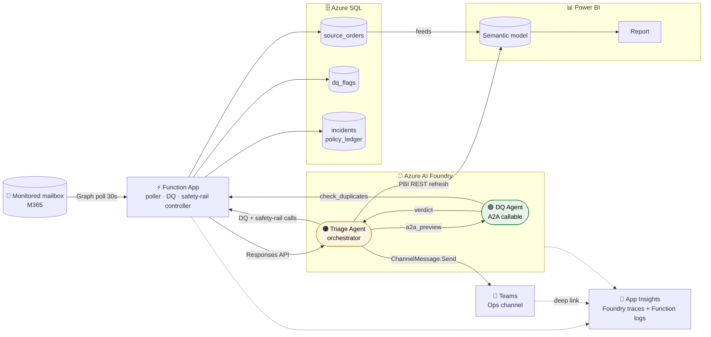

# Architecture — SM Energy BI Triage Demo

> Full walkthrough (identity graph, SQL schema, end-to-end data flow,
> approval path) has moved to [`docs/hosted-architecture.md`](./docs/hosted-architecture.md).

End-to-end architecture for the Foundry agent-to-agent BI triage demo: email
trigger → Function App controller → Foundry agents (Triage + DQ) → Azure SQL
+ Power BI + Teams, with the Cockpit UI, Entra identity, and observability.

## Key flows

- **Trigger:** `demo-fire.ps1` → mailbox → Function App 30s poller → Triage
  Agent (Responses API).
- **Agent-to-agent:** Triage calls DQ via `a2a_preview`; both runs appear
  linked in Foundry traces.
- **Controller safety rails:** every Triage decision routes through
  `/incidents/check_or_open`, `/policy/charge`, and `/policy/propose_action`
  — each backed by a durable SQL row (`dbo.incidents`, `dbo.policy_ledger`).
- **Actions:** Power BI REST refresh (MI-auth OpenAPI tool) or `dq/flag`
  write; Teams post via cross-tenant SP.
- **Cockpit:** read-only FastAPI proxy over `/api/demo/*` using the same
  `api://func-sme` audience, acquired via the presenter's `az login`.
- **Identity:** Foundry MI → Function App + PBI; Function MI → SQL + Graph
  mail; Teams SP for cross-tenant Graph.
