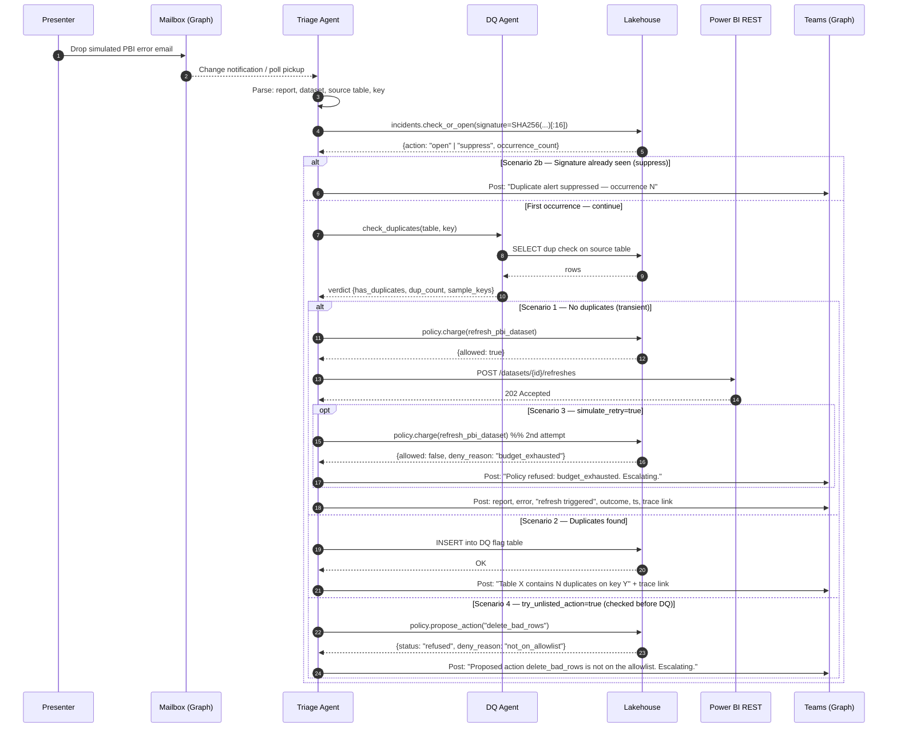

# PRD — the customer BI Triage Demo (Foundry Agent-to-Agent)

**Owner:** Zach Zurlo
**Audience:** Alice (sponsor), Jared (co-sponsor), Kendra (decision-maker being briefed)
**Target demo date:** End of September (soft). Not gated by the mid-September SAP board review.
**Effort bar:** ~75% — cohesive thin end-to-end flow beats a deep build with gaps.

---

## 1. Problem & goal

the customer's AAET team is evaluating Microsoft Foundry as the platform for an internal, long-term agentic BI operations capability. The reference workflow is BI Request Triage & Resolution (see attached flow). Alice needs a live, interactive demo that proves Foundry can do genuine **agent-to-agent orchestration** on Microsoft-native rails (Power BI, Graph, Power BI REST) — not one agent with helper tools.

Kendra is the decision-maker being briefed. Databricks delivered a ~90-minute end-to-end demo against a less-detailed version of this scope, so cohesion and end-to-end feel are the scoring bar. The further the demo pushes toward "an end-to-end agentic platform with bells and whistles that people can build on," the better.

**Goal:** deliver a pausable, live, ~60–90 minute demo in the Microsoft demo tenant showing two scenarios that share the same trigger and orchestrator but diverge on the Data Quality Agent's verdict.

**Non-goal:** production hardening, SM tenant integration, security review, real dedup remediation, or building the full BI Request Triage flow.

---

## 2. Scope

### 2.1 In scope (hard requirements from Alice's email)

- **Two genuinely distinct agents** in Foundry:
  - **Triage Agent** — orchestrator. Receives the trigger, decides intent, calls the DQ Agent, executes the resolution action, posts to Teams.
  - **Data Quality Agent** — called by Triage. Inspects the referenced source table for duplicates on a declared key and returns a structured verdict.
  - Agent-to-agent handoff must be visible in Foundry run traces. A single agent with a duplicate-check tool does **not** satisfy the ask.
- **Both scenarios run end to end, in session:**

  | | Scenario 1 — Transient | Scenario 2 — Data quality |
  |---|---|---|
  | Trigger | PBI error email to monitored inbox | PBI error email to monitored inbox |
  | DQ Agent result | No duplicates found | Duplicates found on key Y |
  | Action | Refresh via Power BI REST API | Write flag record to DQ flag table; no fix |
  | Teams post | Report, error, action, outcome, timestamp | "Table X contains N duplicates on key Y" |

- **Safety-rails scenarios (added after initial scope) — three more branches, all enforced by the Function App controller, not the prompt:**

  | | Scenario 2b — Known issue | Scenario 3 — Policy block | Scenario 4 — Unknown action |
  |---|---|---|---|
  | Trigger | Same PBI error email twice | PBI error email + `simulate_retry:true` | PBI error email + `try_unlisted_action:true` |
  | Controller behavior | 2nd hit matches signature → `action=suppress` | 2nd `refresh_pbi_dataset` charge → `budget_exhausted` | Off-allowlist action → `not_on_allowlist` |
  | Effect | No DQ, no refresh, no flag | No 2nd refresh | No action dispatched |
  | Teams post | "Duplicate alert suppressed — occurrence N (first seen ...)" | "Policy refused: budget_exhausted. Escalating to human." | "Proposed action delete_bad_rows is not on the allowlist. Escalating." |
  | Backing state | `dbo.incidents` row (signature, occurrence_count) | `dbo.policy_ledger` row (allowed=0, deny_reason) | `dbo.policy_ledger` row (allowed=0, deny_reason) |

- **Environment:** Microsoft demo tenant, mock data throughout.
  - Monitored inbox (M365 mailbox).
  - At least one Power BI report + semantic model.
  - Source table with deliberately seeded duplicates.
  - DQ flag table (shown before/after in Scenario 2 so the write is visible on screen).
  - Teams channel/conversation for notifications.
- **Mock data:** small, legible on screen, deterministic (seeded duplicates), and the flag table state shown before and after Scenario 2.
- **Live Q&A readiness — five questions Zach must answer live:**
  1. Agent-to-agent config and what the handoff looks like in logs.
  2. Observability — run traces and how a failed run surfaces.
  3. Email trigger mechanics (polling vs. event-driven) and latency to first agent action.
  4. Auth model for Power BI REST and Teams.
  5. Rough effort for this demo vs. a production equivalent.
- **Delivery format:** live, interactive, pausable mid-flow. Share demo assets afterward (agent definitions, prompts, connection configs) if possible.

### 2.2 Wednesday relaxations (still in scope, but simplified)

- **PBI error is simulated.** A fabricated Power BI report emits a simulated transient error — no real failure-email plumbing required. This retires the biggest chunk of scope.
- **Microsoft-native integration is the scoring criterion.** Power BI, Microsoft Graph, and Power BI REST stay real. Everything else can be mocked cleanly.

### 2.3 Explicitly out of scope

- Enterprise vs. non-Enterprise routing, Enablement/intake paths, Analytics Apps branch, human-involvement branches from the full flow.
- Actual dedup remediation. Scenario 2 ends at flag + notify.
- Production hardening, SM tenant integration, security review.
- Partner delivery — internal build only.

---

## 3. Users & personas (demo audience)

| Persona | Role in demo | What they need to see |
|---|---|---|
| Alice (sponsor) | Validates spec compliance | Two distinct agents, both scenarios end-to-end, mock data legible, Microsoft-native integration real. |
| Jared (co-sponsor) | Technical scrutiny | Run traces, handoff logs, auth story, effort estimate. |
| Kendra (decision-maker) | Platform-level judgment | Cohesive end-to-end feel; sense that this could grow into a build-on-it platform. |

---

## 4. Functional requirements

### FR-1 — Trigger
A simulated Power BI refresh failure event enters the flow via a monitored M365 inbox (Microsoft Graph). The Triage Agent picks it up. Polling cadence and latency-to-first-action must be explainable live.

### FR-2 — Triage Agent (orchestrator)
- Parses the inbound message, extracts report/dataset identifiers and the referenced source table.
- Calls the Data Quality Agent as a **connected agent** (agent-to-agent), passing table + key.
- Branches on DQ verdict:
  - **No duplicates** → call Power BI REST `Datasets - Refresh Dataset` on the target semantic model.
  - **Duplicates** → insert a row into the DQ flag table with `{table, key, dup_count, detected_at, source_run_id}`.
- Posts the outcome to a Teams channel via Graph, including: report, error, action taken, outcome, timestamp, and a link back to the Foundry run trace.

### FR-3 — Data Quality Agent
- Accepts `{table_name, key_columns}`.
- Runs a duplicate check against the mock source (Fabric/SQL/Lakehouse — see §7).
- Returns a structured verdict: `{has_duplicates: bool, dup_count: int, sample_keys: [...]}`.
- Must be independently invocable so the handoff is visible in traces.

### FR-4 — Observability
- Foundry run traces show the parent Triage run and the child DQ run linked.
- A deliberately failed run (e.g., bad table name) can be shown surfacing in traces and in Teams. This is the "how does a failed run surface" answer.

### FR-6 — Controller-enforced safety rails
Three safety-rails behaviors, enforced by Function App endpoints (not by the prompt), each backed by a durable SQL row so the demo can point at it:

- **Incident dedup** — `POST /api/incidents/check_or_open` computes a 16-char SHA-256 signature over the normalized `{report, source_table, key_column, error_class}`. First hit opens an incident; second hit increments `occurrence_count` and returns `action=suppress`. Triage MUST call this as its first tool after `log_event(email_received)` and MUST short-circuit on `suppress`.
- **Remediation budget** — `POST /api/policy/charge` charges the per-run ledger (`dbo.policy_ledger`) before every remediation. Default budget = 1 remediation per `run_id`. On `allowed:false`, Triage MUST NOT take the action and MUST escalate via Teams.
- **Action allowlist** — `POST /api/policy/propose_action` gates arbitrary proposed actions. Allowlist = `{refresh_pbi_dataset, write_dq_flag}`. Anything off-list is refused with `not_on_allowlist` and logged to the same ledger.

Every deny is a `policy_ledger` row. Every suppressed alert is an `incidents` occurrence bump. The cockpit shows both tables live.

### FR-5 — Mock data determinism
- Source table pre-seeded with a known duplicate set for Scenario 2.
- Flag table is empty before Scenario 2 and shows the new row after.
- Both scenarios are re-runnable in the same session (reset script or two separate seed states).

---

## 5. The five live Q&A answers (talk track prep)

1. **Agent-to-agent config & handoff in logs** — Foundry connected agents. Triage is defined with the DQ Agent as a callable connected agent; the run trace shows the parent tool call → child run → child response → parent continuation.
2. **Observability** — Foundry tracing (Application Insights backing store). Failed runs surface as an error span in the parent trace; Teams post includes a deep link.
3. **Email trigger — polling vs. event-driven & latency** — Graph change notifications (webhook/subscription) on the mailbox; fall back to a short-interval poll if webhook setup on the demo tenant is fiddly. First-action latency target: <30s.
4. **Auth model** — Entra ID identities on every hop, no long-lived secrets except the cross-tenant Teams SP.
   - **Foundry project MI → Function App**: Entra token with `aud=api://func-triage`; Function App Easy Auth v2 restricts callers to the project MI's oid.
   - **Function App MI → Azure SQL**: AAD access token acquired via `DefaultAzureCredential`, passed to python-tds. DB user granted `db_datareader + db_datawriter + db_ddladmin` (SID-based, no Directory Readers dependency).
   - **Function App MI → Microsoft Graph (mail)**: `Mail.ReadWrite` application permission (poller only).
   - **Foundry project MI → Power BI REST**: OpenAPI tool with managed-identity auth, audience `https://analysis.windows.net/powerbi/api`. MI added to the demo workspace as Contributor.
   - **Foundry project MI → Microsoft Graph (Teams)**: cross-tenant; OpenAPI tool with connection auth. Project connection `teams-graph-sp` holds a Teams-tenant Entra app's client id + secret with `ChannelMessage.Send` (application). Secret rotation is the one operational thing to own.
   - **Foundry Triage → Foundry DQ**: `a2a_preview` tool, anonymous auth (same project).
5. **Effort: demo vs. production** — Demo: ~5 weeks part-time by one shared resource. Production equivalent (SM tenant, real failure plumbing, human-in-loop branches, Enterprise routing, hardening, security review): 4–6x, plus ongoing platform ownership.

---

## 6. Non-functional requirements

- **Live-runnable in <5 min per scenario.** Reset in <1 min between runs.
- **Legibility.** All on-screen tables ≤10 rows and readable at projector resolution.
- **Pausable.** Every stage (email received → parse → DQ call → verdict → action → Teams post) can be paused for narration.
- **Portability of assets.** Agent YAML/JSON, prompts, and connection configs exportable for share-out.

---

## 7. Architecture

### 7.1 Component choices

| Layer | Choice | Why |
|---|---|---|
| Agent runtime | **Azure AI Foundry** — prompt agents (declarative) with A2A connected-agent binding | Required by ask; parent/child trace linking; instructions + tools live in shareable YAML (PRD §9). |
| Orchestration model | Triage prompt agent binds DQ prompt agent via `a2a_preview` toolbox entry | Simplest config that still produces genuine agent-to-agent traces. |
| Trigger | **Microsoft Graph** mail poller on a 30s timer inside the Function App | Event-driven equivalent via subscription is a talk-track fallback; the timer keeps demo simple. |
| Data plane | **Azure SQL Database** (private endpoint) — source table + DQ flag table | Native to the Microsoft story; visible in Power BI. |
| SQL access layer | **Azure Function App (Flex Consumption, Python 3.11, VNet-integrated)** exposing `/dq/check`, `/dq/flag`, `/admin/*`, plus the mailbox timer | One Function replaces two agent containers + ACR + ACI jumpbox + ACI trigger. Talks to SQL via python-tds + MI access token. |
| BI | **Power BI** semantic model + one report on the source | Required real Microsoft-native surface. |
| Action API | **Power BI REST** — `Datasets - Refresh Dataset` bound as an OpenAPI tool on Triage (managed-identity auth) | Required real surface; scenario 1 action. |
| Notification | **Microsoft Graph** — Teams `ChannelMessage.Send` bound as an OpenAPI tool on Triage (connection auth, cross-tenant SP) | Required real surface; both scenarios. |
| Identity | **Entra ID**: Foundry project MI, Function App MI, one cross-tenant Teams SP. No Key Vault needed for the demo (Teams SP secret lives in a Foundry project connection). | Answers Q4; realistic without being production-hardened. |
| Observability | Foundry tracing (Application Insights) + Function App Application Insights | Answers Q1, Q2. |

### 7.2 Architecture diagram

```mermaid
flowchart LR
    subgraph Trigger["Trigger surface"]
        MBX[("Monitored mailbox<br/>M365")]
        SIM["Simulated PBI<br/>error email"]
        SIM --> MBX
    end

    subgraph FuncApp["Azure Function App (VNet-integrated)"]
        POLL["poll_inbox<br/>(30s timer)"]
        DQCHK["POST /dq/check"]
        DQFLG["POST /dq/flag"]
        ADMIN["POST /admin/{seed,reset,flags,rows,cleanup}"]
    end
    MBX --> POLL

    subgraph Foundry["Azure AI Foundry (prompt agents)"]
        direction TB
        TRI(["🟠 Triage Agent<br/>(prompt, orchestrator)"])
        DQ(["🟢 DQ Agent<br/>(prompt, A2A callable)"])
        TRI -- "a2a_preview: dq-agent" --> DQ
        DQ  -- "verdict: has_duplicates, dup_count, sample_keys" --> TRI
    end
    POLL -- "Responses invoke" --> TRI

    subgraph Data["Azure SQL Database (private)"]
        SRC[("source_orders<br/>seeded duplicates")]
        FLAG[("dq_flags")]
    end
    DQ  -- "openapi(MI): check_duplicates" --> DQCHK
    TRI -- "openapi(MI): write_dq_flag"    --> DQFLG
    DQCHK -- "python-tds + MI token" --> SRC
    DQFLG -- "python-tds + MI token" --> FLAG
    ADMIN -- "python-tds + MI token" --> SRC
    ADMIN -- "python-tds + MI token" --> FLAG

    subgraph PBI["Power BI"]
        SEM[("Semantic model")]
        RPT["Report"]
        SEM --> RPT
        SRC -.feeds.-> SEM
    end
    TRI -- "openapi(MI): POST /refreshes" --> SEM

    subgraph Notify["Microsoft Teams (cross-tenant)"]
        CH["Ops channel"]
    end
    TRI -- "openapi(connection): ChannelMessage.Send" --> CH

    subgraph Identity["Entra ID"]
        FMI["Foundry project MI"]
        FnMI["Function App MI"]
        TSP["Teams-tenant SP<br/>(client secret)"]
    end
    FMI  -.aud=api://func-triage.-> FuncApp
    FMI  -.PBI REST.-> PBI
    TSP  -.Graph Teams.-> Notify
    FnMI -.SQL access token.-> Data
    FnMI -.Mail.ReadWrite.-> Trigger

    subgraph Obs["Observability"]
        TRACE["Foundry run traces<br/>(App Insights)"]
        FUNCAI["Function App Insights"]
    end
    Foundry  -.emits.-> TRACE
    FuncApp  -.emits.-> FUNCAI
    CH -.deep link.-> TRACE

    classDef triage fill:#fff4e0,stroke:#c47f17,color:#000
    classDef agent fill:#e6f4ea,stroke:#137333,color:#000
    class TRI triage
    class DQ agent
```

### 7.3 Scenario sequence



---

## 8. Demo script (outline)

The **Demo Cockpit** (`cockpit/`) is the primary on-screen surface for steps 2–5. It shows the inbox, live agent flow, SQL state (source_orders, dq_flags, incidents, policy_ledger), and the last Teams Adaptive Card on a single full-screen page that polls every ~2s. Foundry run traces are opened on demand for the Q1/Q2 discussion in step 6.

For a **60-min slot** use steps 1–4 + 6. For a **90-min slot** run everything.

1. **Set the stage (5–8 min).** Show the flow diagram, call out the branches in scope, show the mock inbox / lakehouse tables / Teams channel / Power BI report — everything empty/clean.
2. **Scenario 1 — Transient (10–12 min).** `./demo-fire.ps1 clean` → narrate Triage pickup → show DQ call in Foundry trace → verdict "no dupes" → policy_charge allowed → Power BI REST refresh → Teams post. Pause on the trace to answer Q1/Q2.
3. **Scenario 2 — Data quality (10–12 min).** `./demo-fire.ps1 duplicates` → show flag table empty → DQ verdict "duplicates found" → flag row appears → Teams post. Show flag table after.
4. **Failure path (5–7 min).** `./demo-fire.ps1 fail` — bad-table run to show error surfacing in trace + Teams.
5. **Safety rails (10 min, 90-min slot only).** Frame as "three ways the system refuses to do the wrong thing":
   - `./demo-fire.ps1 known_issue` — same alert twice; 2nd row lands as `duplicate_suppressed`; incidents tile shows `occurrence_count=2`.
   - `./demo-fire.ps1 policy_block` — `simulate_retry=true`; policy ledger shows the 2nd refresh charge denied with `budget_exhausted`; Teams card says "Escalating to human."
   - `./demo-fire.ps1 unknown_action` — `try_unlisted_action=true`; policy ledger shows `delete_bad_rows` refused with `not_on_allowlist`; Teams card says "Not on the allowlist. Escalating."
6. **Q&A (20–40 min).** Walk the five prepared answers with live artifacts (agent config, connection strings redacted, KV reference, Graph subscription, policy_ledger rows).

---

## 9. Deliverables (shared after)

- Foundry prompt-agent definitions for Triage and DQ (`agents/definitions/*.yaml`) — full share-out, no secrets.
- OpenAPI specs bound as tools (`function/openapi-*.yaml`, `agents/definitions/openapi/*.yaml`).
- Idempotent deploy script (`agents/deploy-agents.ps1`) that PATCHes both agents into the Foundry project.
- Function App source (`function/function_app.py`) — the DQ + admin + poller runtime.
- Bicep templates for SQL, VNet + private endpoint, Foundry, and the Function App.
- SQL grant script for the Function App MI (`grant-function-mi.sql`).
- Connection descriptors (`teams-graph-sp` — Teams-tenant SP for the cross-tenant Graph call) — redacted.
- This PRD + architecture diagram.

---

## 10. Risks & mitigations

| Risk | Mitigation |
|---|---|
| Graph mail subscription setup slow on demo tenant | Fallback to short-interval poll; document both in Q3 answer. |
| Power BI REST auth (SP on workspace) trips up on demo tenant | Pre-provision workspace membership; test refresh call day 1. |
| Connected-agent tracing looks like a tool call, not a "real" handoff | Add a narration slide showing the parent/child run linkage explicitly. |
| Demo overruns and can't be paused cleanly | Build explicit pause points between the 6 sequence steps; each is independently re-runnable. |
| Kendra reads "75%" as "half-built" | Lead with cohesion — one unbroken thin flow, both scenarios, one failure path. |
| LLM ignores a payload demo signal (`simulate_retry`, `try_unlisted_action`) and the safety-rails scenario doesn't fire | Run each safety-rails scenario dry the night before; keep the raw payload visible in the cockpit so a no-fire is obvious; fall back to walking the `policy_ledger` rows from a prior good run. |

---

## 11. Open questions

- Fabric Lakehouse vs. Azure SQL for the mock data plane — which is faster to seed and demo in the Microsoft demo tenant?
- Do we have a pre-provisioned demo-tenant mailbox + Teams channel we can reuse, or do we stand up fresh?
- Confirm the Power BI workspace tier available in the demo tenant supports REST refresh via SP.
